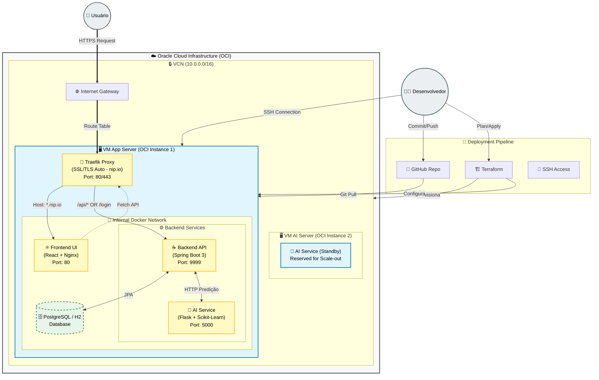

# 🗺️ Arquitetura E2E & Workflow Visual - ChurnInsight

Este documento apresenta a infraestrutura completa, o pipeline de deployment e os fluxos de dados da aplicação **ChurnInsight** na Oracle Cloud Infrastructure (OCI).

> **Para Modelo NanoBanana**: Use os códigos Mermaid abaixo para gerar visualizações ricas da topologia.

## 🏗️ Topologia da Infraestrutura (Mermaid Graph)

Visão completa desde o usuário até a infraestrutura na nuvem.



---

## 🔄 Fluxo de Negócio E2E: Análise de Churn (Sequence Diagram)

Detalhamento de como um arquivo CSV se transforma em insights de negócio.

```mermaid
sequenceDiagram
    autonumber
    
    actor U as 👤 Usuário
    participant P as 🚦 Traefik (Proxy)
    participant F as ⚛️ Frontend (React)
    participant B as ☕ Backend (Spring Security)
    participant A as 🐍 AI Service (Python)
    participant D as 🗄️ Database

    box rgb(240, 248, 255) "Autenticação"
    U->>P: Acessa https://...nip.io
    P->>F: Serve Aplicação React
    U->>F: Preenche Login (admin/123456)
    F->>P: POST /login
    P->>B: Encaminha Requisição
    B->>B: Valida Credenciais (Spring Security)
    B-->>F: Retorna Token JWT (200 OK)
    end

    box rgb(255, 248, 240) "Processamento Batch (E2E)"
    U->>F: Upload CSV Clientes
    F->>P: POST /api/churn/upload (Multipart)
    P->>B: Encaminha com Token
    B->>B: Valida Token & Parse CSV
    B->>D: Salva Dados Brutos (Transacional)
    
    par Processamento Assíncrono / Rápido
        B->>A: POST /predict (Lista de Clientes)
        Note right of A: Modelo Random Forest<br/>Calcula Probabilidade
        A-->>B: Retorna [Score, Classe]
    end
    
    B->>D: Atualiza Clientes com Score de Churn
    B-->>F: Retorna JSON (Status Processamento)
    end

    box rgb(240, 255, 240) "Visualização"
    F->>P: GET /api/dashboard/metrics
    P->>B: Request Métricas
    B->>D: Query SQL (Agregação)
    D-->>B: Dados Consolidados
    B-->>F: JSON Métricas
    F-->>U: Renderiza Gráficos & KPIs
    end
```

## 🛠️ Stack Tecnológico

| Camada | Tecnologia | Função |
| :--- | :--- | :--- |
| **Infra OCI** | Terraform | Código para criar VCN, Security Lists, VM |
| **Proxy** | Traefik | SSL Automático (Let's Encrypt), Roteamento |
| **Frontend** | React + Vite | Interface do Usuário, Dashboard |
| **Backend** | Spring Boot 3 | API REST, Segurança (JWT), Orquestração |
| **IA/ML** | Python (Flask) | Modelo Preditivo, Scikit-Learn |
| **Dados** | PostgreSQL | Persistência Relacional |
| **OS** | Oracle Linux 8 | Sistema Operacional da VM |

---
*Gerado para documentação visual do projeto ChurnInsight.*
