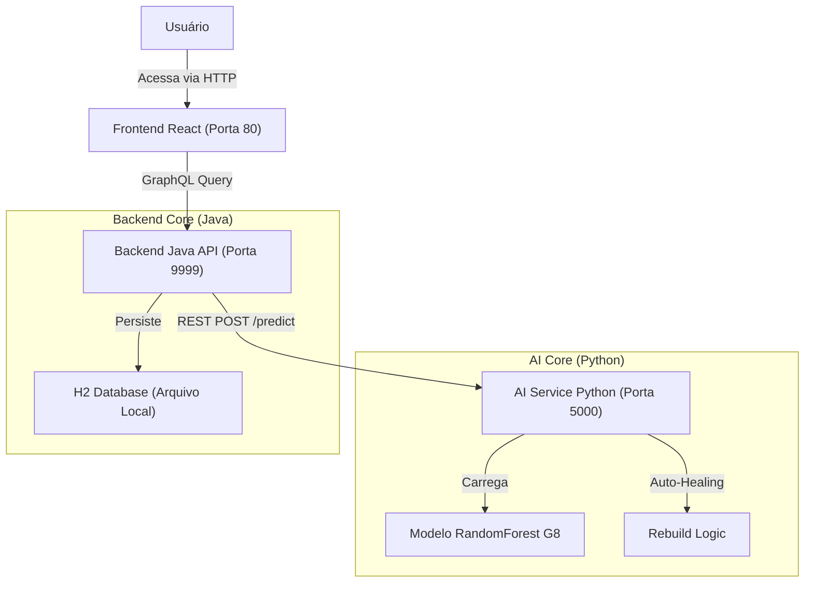

# 📊 ChurnInsight: Monitoramento de Risco de Cancelamento

> **Sistema Híbrido de Inteligência Artificial para Previsão de Churn**
> *Hackathon Alura G8 - Versão Final*


---

## 🚀 Como Rodar o Projeto

O projeto foi desenhado para **Zero Configuração**. Basta ter o Docker instalado.

### 1. Clonar o Repositório

```bash
git clone https://github.com/Araken13/ML-API-REST-HIBRIDA-HACKATHON-ONE-8.git
cd ML-API-REST-HIBRIDA-HACKATHON-ONE-8
```

### 2. Iniciar os Serviços

Execute o comando abaixo e aguarde alguns minutos até que todos os serviços levantem (especialmente o backend Java):

```bash
docker-compose up --build
```

### 3. Acessar o Sistema

| Serviço | URL | Descrição |
|---------|-----|-----------|
| **Dashboard (Frontend)** | [http://localhost:80](http://localhost:80) | Interface principal para análise de dados. |
| **API GraphQL** | [http://localhost:9999/graphiql](http://localhost:9999/graphiql) | Playground para consultas diretas ao Backend. |
| **AI Docs** | [http://localhost:5000/docs](http://localhost:5000/docs) | Documentação técnica do modelo de ML. |

🔐 **Credenciais de Acesso:**

* **Login:** `admin`
* **Senha:** `123`

---

## 🏗️ Arquitetura Técnica

O sistema opera com três microserviços integrados via Docker:



1. **Frontend (React + Vite):** Interface responsiva para upload de CSVs e visualização de dashboards.
2. **Backend (Java 17 Spring Boot):** Gerencia autenticação (JWT), regras de negócio e persistência no banco H2.
3. **AI Service (Python 3.11):** Executa o modelo de Machine Learning, com funcionalidades de **Auto-Healing** (reconstrução automática do modelo em caso de falha).

---

## 🧠 Sobre o Modelo de IA

O sistema utiliza um modelo **RandomForest** treinado para identificar probabilidade de cancelamento.

* **Classificação de Risco:**
  * 🔴 **Alto Risco:** Probabilidade > **42.87%**
  * 🟠 **Risco Médio:** Probabilidade entre **25%** e **42.87%**
  * 🟢 **Baixo Risco:** Probabilidade < **25%**

* **Entrada de Dados:** O sistema normaliza automaticamente arquivos CSV (converte `CamelCase` para `snake_case`), garantindo compatibilidade entre os dados do sistema legado e o modelo de ML.

---

## 📂 Estrutura do Projeto

* `ai_service/`: Código Python, API FastAPI e scripts de treinamento.
* `src/`: Código Java do Backend Spring Boot.
* `frontend/`: Código da aplicação React.
* `hackathon_g8_one/`: Artefatos de Data Science (Notebooks, Datasets originais).
* `docker-compose.yml`: Orquestração dos containers.

---

**Desenvolvido pela Equipe G8 - Hackathon Alura**
