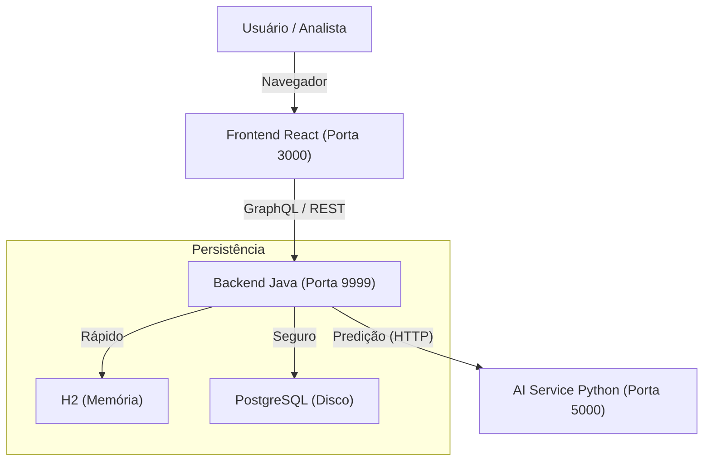

# 📊 ChurnInsight: Monitoramento de Risco de Cancelamento

> **Sistema Híbrido de Inteligência Artificial para Previsão de Churn**
> *Hackathon Alura G8 - Solução Enterprise*


---

## 🧐 O que é este projeto?

O **ChurnInsight** é uma plataforma analítica completa que ajuda empresas a identificar quais clientes têm maior probabilidade de cancelar seus serviços (Churn).

Diferente de soluções simples, este sistema é **Full-Stack e Híbrido**:

* **IA Real**: Usa um modelo *RandomForest* treinado em Python.
* **API Híbrida**: Oferece **REST** (para integração legada) e **GraphQL** (para frontends modernos).
* **Dashboard Interativo**: Interface React para análise em tempo real.
* **Processamento Massivo**: Pipeline otimizado para processar arquivos CSV com 50.000+ clientes em minutos.

---

## 📚 Documentação Completa

Para detalhes específicos, consulte nossos guias oficiais incluídos neste repositório:

| Documento | Descrição |
| :--- | :--- |
| [📘 Manual de Uso](./MANUAL_DE_USO.md) | Guia para o usuário final: como navegar, interpretar gráficos e usar o simulador. |
| [📡 Documentação da API](./API_DOCUMENTATION.md) | Swagger, Endpoints, Schemas GraphQL e exemplos de cURL. |
| [🏛️ Decisões de Arquitetura](./DECISOES_ARQUITETURA.md) | Por que usamos Java + Python? Por que 2 bancos de dados? Leia aqui. |

---

## 🚀 Guia Rápido (Quick Start)

Rodar este projeto é extremante simples. Você precisa apenas do **Docker Desktop** instalado.

### 1. Clonar o Repositório

```bash
git clone https://github.com/Araken13/ML-API-REST-HIBRIDA-HACKATHON-ONE-8.git
cd ML-API-REST-HIBRIDA-HACKATHON-ONE-8
```

### 2. Iniciar o Ambiente

No terminal, dentro da pasta do projeto:

```bash
docker-compose up -d --build
```

> *Aguarde cerca de 2 minutos na primeira vez para o build dos containers e inicialização do Banco de Dados.*

### 2. Acessar o Sistema

* **Frontend (Dashboard):** [http://localhost:3000](http://localhost:3000)
* **Login:** `admin`
* **Senha:** `123`

### 3. Links de Desenvolvimento

* **GraphQL Playground:** [http://localhost:9999/graphiql](http://localhost:9999/graphiql)
* **Swagger UI (AI Service):** [http://localhost:5000/docs](http://localhost:5000/docs)

---

## 🆘 Troubleshooting (Problemas Comuns)

**🔴 Erro: `Conflict. The container name "/ai-service" is already in use`**
Isso acontece se você rodou o projeto antes e ele não desligou corretamente.

* **Solução:** Rode este comando para limpar containers antigos:

    ```bash
    docker rm -f $(docker ps -aq)
    ```

**🔴 Erro: Frontend não carrega os dados**
Certifique-se de que o Backend (Porta 9999) subiu completamente.

* **Solução:** Verifique os logs:

    ```bash
    docker logs backend-api -f
    ```

---

## 🏗️ Arquitetura do Sistema

Operamos com 3 serviços principais orquestrados:



### Destaques Técnicos

* **Auto-Healing**: Se o serviço de IA cair, ele reinicia automaticamente.
* **Double-Write**: Gravamos dados no H2 (para velocidade extrema no dashboard) e no PostgreSQL (para segurança) simultaneamente.
* **Poliglota**: Backend em Java (Spring Boot 3) e IA em Python (FastAPI + Scikit-Learn).

---

## 🧪 Testes Automatizados

O projeto inclui scripts que testam o fluxo de ponta a ponta (Login -> Upload -> Previsão).

**Executar todos os testes (Windows Powershell):**

```powershell
./run_all_tests.ps1
```

---

---

## 🏆 Diferenciais Competitivos (Por que este projeto é Enterprise?)

Diferente de MVPs comuns, o **ChurnInsight** foi arquitetado com padrões de Engenharia de Software robustos:

### 1. 🛡️ Resiliência e Auto-Healing

O sistema utiliza Docker Healthchecks avançados. Se o microserviço de IA falhar (ex: estouro de memória), o orquestrador o **reinicia automaticamente** sem derrubar a aplicação principal.

### 2. ⚡ Arquitetura "Double-Write" (Híbrida)

Combinamos a velocidade do **H2 (In-Memory)** para dashboards em tempo real com a segurança do **PostgreSQL** para persistência física.

* **Resultado:** Leituras em microssegundos e tolerância a falhas de infraestrutura.

### 3. 🚀 Processamento Paralelo (Multi-Thread)

O upload de CSVs não bloqueia o servidor. Utilizamos `CompletableFuture` e Pools de Threads em Java para processar 50.000 clientes em background enquanto a API continua respondendo instantaneamente a outras requisições.

### 4. 🧩 Poliglotismo Estratégico

* **Java (Spring Boot):** Cuida da Segurança (JWT), Transações e Regras de Negócio.
* **Python (FastAPI):** Dedicado exclusivamente à matemática pesada (RandomForest).
* **Benefício:** Permite escalar a IA separadamente do Backend na nuvem.

---

**Desenvolvido pela Equipe G8**
