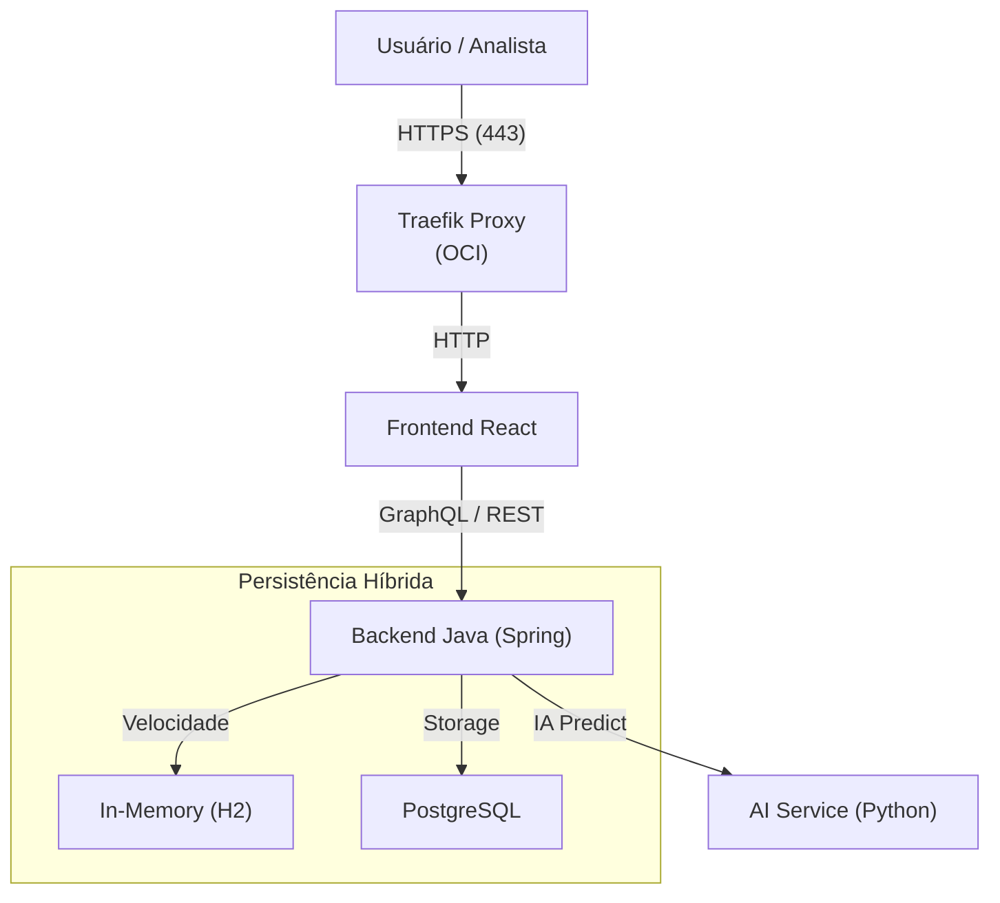

# 📊 ChurnInsight: Prevenção de Churn em Assinantes de Streaming

> **Sistema Híbrido de Inteligência Artificial para Previsão de Churn**
> *Hackathon Alura G8 - Solução Enterprise*


---

## 🔬 Destaque: Entrega de Data Science

O motor de IA desta plataforma foi construído com base em análise rigorosa de 30.000 registros.

- **Relatório DS Completo:** [📄 Leia o README_DS](./DATASCIENCE/README_DS.md)
- **Insights Principais:** [💡 Visualizar Insights](#-3-análise-exploratória-eda--insights)

---

## 🔗 Atalhos Rápidos

- [🚀 Guia de Execução](#-guia-rápido-quick-start) | [🏗️ Arquitetura](#-arquitetura-do-sistema) | [📡 API Documentation](./docs/API_DOCUMENTATION.md) | [🌐 Apresentação](https://araken13.github.io/ML-API-REST-HIBRIDA-HACKATHON-ONE-8/presentation.html)

---

# 🎯 1. O Problema de Negócio

Somos a **Streaming**, uma plataforma 100% brasileira focada em produções nacionais e esportes locais. Recentemente, enfrentamos um desafio crítico: nossa taxa de cancelamento (**Churn**) disparou.

**Objetivo:** Limpar os dados, identificar padrões de cancelamento, prever quem irá sair e entregar uma API resiliente para que o time de CRM possa atuar preventivamente.

---

# 📖 2. Dicionário de Dados & Metodologia

## Descrição das Variáveis Principais

* **`churn` (Target):** Indica se o cliente cancelou (1) ou está ativo (0).
- **`tempo_assinatura_meses`:** Maturidade do cliente na plataforma.
- **`dias_ultimo_acesso`:** Thermômetro de inatividade.
- **`engajamento`:** Score baseado em visualizações e tempo de sessão.

## 🛠️ Tecnologias & Processo

O projeto foi desenvolvido utilizando a stack **Python (Scikit-learn/Pandas)** para a ciência de dados e **Java (Spring Boot 3)** + **React** para a infraestrutura de serviço.

---

# 🔍 3. Análise Exploratória (EDA) & Insights

### 📉 Proporção de Churn

Atualmente, **24,9% (7.471 clientes)** cancelaram o serviço. A retenção crítica ocorre entre o **1º e 4º mês**, com uma queda acentuada no **38º mês**.

### 💡 Principais Insights de Negócio

1. **Inatividade é Fatal:** Clientes sem acesso há mais de 60 dias possuem **81,7% de chance de churn**.
2. **Suporte como Alerta:** O churn escala de 17% (0 contatos) para **46,4% (3+ contatos)**. O primeiro contato é o *tipping point*.
3. **Método de Pagamento:** O **Crédito Recorrente** é o maior aliado da retenção (18,6% churn), enquanto o **Boleto** é o maior vilão (47,2% churn).
4. **Contrato Anual:** Clientes anuais cancelam **menos da metade** (13,2%) em relação aos mensais (29,5%).


---

# 🤖 4. Relatório de Data Science

O modelo preditivo atingiu níveis de **Excelência Enterprise**:

- **F1-Score (Validação):** 0.9531
- **ROC-AUC:** 0.9957
- **Modelo:** Random Forest calibrado via *Isotonic Regression*.

### Importância das Features (Drivers de Churn)

1. **Engajamento Score:** 29.43%
2. **Tempo Médio de Sessão:** 26.62%
3. **Avaliação de Conteúdo:** 8.62%

---

# 🏗️ Arquitetura do Sistema

O **ChurnInsight** não é apenas um modelo, é uma **infraestrutura pronta para produção**:



### 🏆 Diferenciais Enterprise

* **Double-Write:** Persistência simultânea em H2 (Dashboards rápidos) e PostgreSQL (Segurança).
- **Auto-Healing:** Microserviços Docker com reinicialização automática em caso de falha.
- **Escalabilidade OCI:** Provisionado via Terraform na Oracle Cloud Infrastructure.

---

# 🚀 Guia Rápido (Quick Start)

### 1. Iniciar Ambiente Local

```bash
docker compose -f docker-compose.local.yml up -d --build
```

### 2. Acessar o Sistema

* **Dashboard:** [http://localhost:3000](http://localhost:3000)
- **Login:** `admin` / `123456`

---

# ☁️ Deployment OCI (Arquitetura Visual)


---

### 📂 Links do Projeto

- [Repositório Principal](https://github.com/Araken13/ML-API-REST-HIBRIDA-HACKATHON-ONE-8)
- [Notebook Modelo DS](https://github.com/Araken13/ML-API-REST-HIBRIDA-HACKATHON-ONE-8/blob/Data_Science/DATASCIENCE/Streaming_DS.ipynb)

---
*Desenvolvido pela Equipe G8 - Hackathon Alura 2026*
