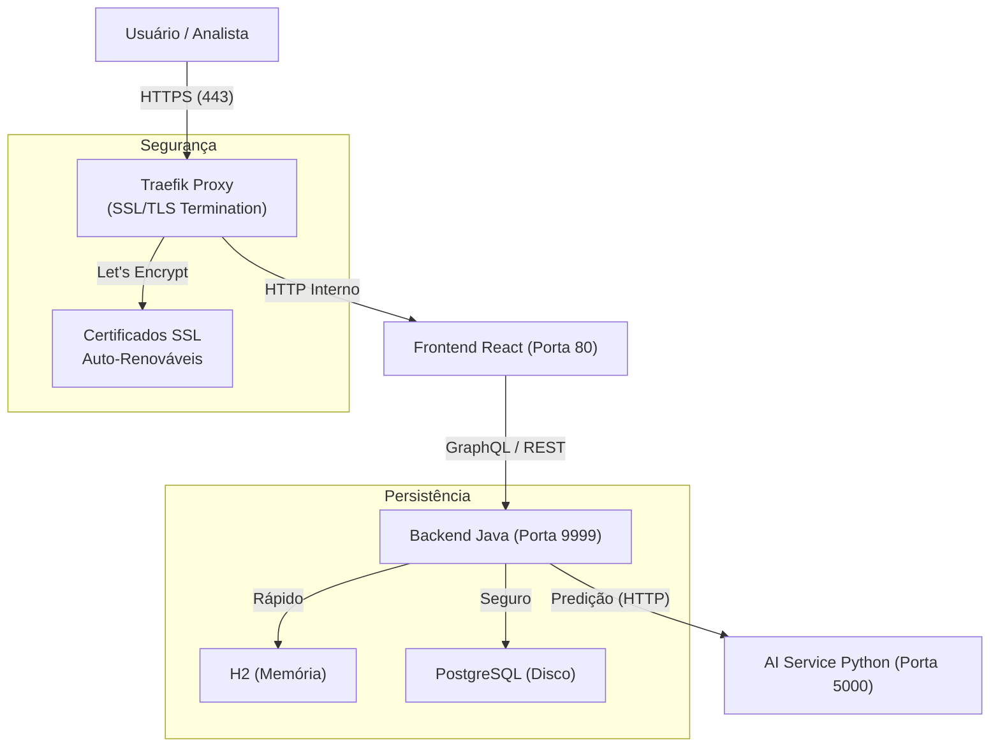

# 📊 ChurnInsight: Monitoramento de Risco de Cancelamento

> **Sistema Híbrido de Inteligência Artificial para Previsão de Churn**
> *Hackathon Alura G8 - Solução Enterprise*


---

## 🔬 Destaque: Entrega do Time de Data Science

O motor de IA desta plataforma foi construído com base em análise rigorosa de **30.000 registros**. O time de Data Science produziu um relatório completo com insights de negócio e o modelo preditivo final.

📄 **[Acesse o Relatório Completo de Data Science](./DATASCIENCE/README_DS.md)**

**Principais Métricas do Modelo:**

* **F1-Score:** 0.9531 | **ROC-AUC:** 0.9957
* **Top Driver:** Engajamento Score (29.43% do poder preditivo)

---

## 🧐 O que é este projeto?

O **ChurnInsight** é uma plataforma analítica completa que ajuda empresas a identificar quais clientes têm maior probabilidade de cancelar seus serviços (Churn).

Diferente de soluções simples, este sistema é **Full-Stack e Híbrido**:

* **IA Real**: Usa um modelo *RandomForest* treinado em Python.
* **API Híbrida**: Oferece **REST** (para integração legada) e **GraphQL** (para frontends modernos).
* **Dashboard Interativo**: Interface React para análise em tempo real.
* **Processamento Massivo**: Pipeline otimizado para processar arquivos CSV com 50.000+ clientes em minutos.

---

## 📚 Mapa da Documentação

Abaixo você encontra o mapa completo de documentação técnica e funcional do projeto:

### 📖 Guia do Usuário e API

* [📘 **Manual de Uso**](./docs/MANUAL_DE_USO.md): Guia para o usuário final e navegação no Dashboard.
* [📡 **Documentação da API**](./docs/API_DOCUMENTATION.md): Detalhes de Endpoints, Schemas GraphQL e Exemplos.
* [🛠️ **Manual de Erros**](./docs/MANUAL_DE_ERROS.md): Guia de Troubleshooting e resolução de problemas comuns.

### 🏗️ Arquitetura e Decisões Técnicas

* [🏛️ **Decisões de Arquitetura**](./docs/DECISOES_ARQUITETURA.md): Justificativas para a escolha da stack e padrões.
* [📐 **Arquitetura do Sistema**](./docs/ARCHITECTURE.md): Detalhes sobre o padrão *Double-Write* e persistência.
* [🔄 **Workflow Visual E2E**](./docs/PROJECT_ARCHITECTURE_WORKFLOW.md): Diagramas de sequência e fluxos de dados completos.

### ☁️ Infraestrutura e Cloud (OCI)

* [🌐 **Guia de Rede OCI**](./docs/OCI_NETWORK_DOCS.md): Detalhes de VCN, Subnets e Security Lists.
* [🔑 **Informações de Acesso**](./docs/OCI_ACCESS_INFO.md): Credenciais e IPs da infraestrutura na nuvem.
* [🚀 **Pipeline OCI**](./oci-pipeline/README.md): Instruções sobre o provisionamento via Terraform.

### 🛡️ Segurança e Operações

* [🔐 **Guia de Segurança**](./docs/SECURITY_GUIDE.md): Práticas de proteção de dados e autenticação JWT.
* [🌐 **Configuração HTTPS**](./docs/HTTPS_CONFIGURATION.md): Detalhes sobre SSL/TLS e Traefik.
* [🧪 **Evidências de Teste HTTPS**](./docs/TESTE_HTTPS.md): Relatório de validação da camada segura.
* [📜 **Changelog**](./docs/CHANGELOG.md): Histórico de versões e melhorias.
* [📊 **Relatório de Status**](./docs/RELATORIO_STATUS.md): Estado atual da entrega e funcionalidades.

---

## 🚀 Guia Rápido (Quick Start)

### Desenvolvimento Local Simplificado (Recomendado)

Rodar este projeto localmente para desenvolvimento ou demonstração (sem HTTPS/Traefik complexo) é simples:

#### 1. Clonar o Repositório

```bash
git clone https://github.com/Araken13/ML-API-REST-HIBRIDA-HACKATHON-ONE-8.git
cd ML-API-REST-HIBRIDA-HACKATHON-ONE-8
```

#### 2. Iniciar o Ambiente (Modo Local)

Utilize o arquivo de composição local que libera a porta **3000** e otimiza a inicialização:

```bash
docker compose -f docker-compose.local.yml up -d --build
```

> *Aguarde cerca de 2 minutos para o build e inicialização dos serviços.*

#### 3. Acessar o Sistema

* **Frontend (Dashboard):** [http://localhost:3000](http://localhost:3000)
* **API Backend:** [http://localhost:9999](http://localhost:9999)
* **Login Padrão:** `admin` / `123456`

---

## 🎬 Modo Apresentação (Live Demo)

O projeto inclui ferramentas de automação para apresentações ao vivo ("Demo Mode"), com capas visuais e orquestração de cenários.

**Para iniciar a Demo Local:**

1. Certifique-se que o Docker está rodando (Passo 2 acima).
2. Execute o script de capa:

```powershell
powershell -ExecutionPolicy Bypass -File developer_tools/scripts/presentation_cover_local.ps1
```

1. Pressione **ENTER** para abrir o Menu do Orquestrador.
2. Escolha **Opção 2 (Demo Visual)** para apresentar dados reais ou **Opção 3** para Teste de Carga.

### 🌐 Deploy em Produção (OCI/Cloud)

O projeto inclui configuração automática de **HTTPS com certificado SSL válido** usando Traefik e Let's Encrypt.

#### Acesso em Produção

* **URL Segura (HTTPS):** `https://<SEU_IP>.nip.io`
* **Certificado SSL:** Gerado automaticamente pelo Let's Encrypt
* **Redirecionamento:** HTTP → HTTPS automático

#### Infraestrutura OCI

O projeto inclui scripts Terraform para deploy na Oracle Cloud Infrastructure (OCI):

* **Localização:** `oci-pipeline/terraform/`
* **Controle de VMs:** `OCI_VM-Control/CONTROLE_OCI.bat`
* **Documentação:** Veja [OCI_ACCESS_INFO.md](docs/OCI_ACCESS_INFO.md) e [OCI_NETWORK_DOCS.md](docs/OCI_NETWORK_DOCS.md)

---

## 🆘 Troubleshooting (Problemas Comuns)

**🔴 Erro: `Conflict. The container name "/ai-service" is already in use`**
Isso acontece se você rodou o projeto antes e ele não desligou corretamente.

* **Solução:** Rode este comando para limpar containers antigos:

    ```bash
    docker rm -f $(docker ps -aq)
    ```

**🔴 Erro: Frontend não carrega os dados**
Certifique-se de que o Backend (Porta 9999) subiu completamente.

* **Solução:** Verifique os logs:

    ```bash
    docker logs backend-api -f
    ```

---

## 🏗️ Arquitetura do Sistema

Operamos com 4 serviços principais orquestrados:



### Destaques Técnicos

* **HTTPS Automático**: Certificados SSL válidos gerados automaticamente via Let's Encrypt com renovação automática.
* **Auto-Healing**: Se o serviço de IA cair, ele reinicia automaticamente.
* **Double-Write**: Gravamos dados no H2 (para velocidade extrema no dashboard) e no PostgreSQL (para segurança) simultaneamente.
* **Poliglota**: Backend em Java (Spring Boot 3) e IA em Python (FastAPI + Scikit-Learn).
* **Reverse Proxy**: Traefik gerencia roteamento, SSL/TLS e balanceamento de carga.

---

## 🧪 Testes Automatizados

O projeto inclui scripts que testam o fluxo de ponta a ponta (Login -> Upload -> Previsão).

**Executar todos os testes (Windows Powershell):**

```powershell
./run_all_tests.ps1
```

---

---

## 🏆 Diferenciais Competitivos (Por que este projeto é Enterprise?)

Diferente de MVPs comuns, o **ChurnInsight** foi arquitetado com padrões de Engenharia de Software robustos:

### 1. 🛡️ Resiliência e Auto-Healing

O sistema utiliza Docker Healthchecks avançados. Se o microserviço de IA falhar (ex: estouro de memória), o orquestrador o **reinicia automaticamente** sem derrubar a aplicação principal.

### 2. ⚡ Arquitetura "Double-Write" (Híbrida)

Combinamos a velocidade do **H2 (In-Memory)** para dashboards em tempo real com a segurança do **PostgreSQL** para persistência física.

* **Resultado:** Leituras em microssegundos e tolerância a falhas de infraestrutura.

### 3. 🚀 Processamento Paralelo (Multi-Thread)

O upload de CSVs não bloqueia o servidor. Utilizamos `CompletableFuture` e Pools de Threads em Java para processar 50.000 clientes em background enquanto a API continua respondendo instantaneamente a outras requisições.

### 4. 🧩 Poliglotismo Estratégico

* **Java (Spring Boot):** Cuida da Segurança (JWT), Transações e Regras de Negócio.
* **Python (FastAPI):** Dedicado exclusivamente à matemática pesada (RandomForest).
* **Benefício:** Permite escalar a IA separadamente do Backend na nuvem.

---

---
*Desenvolvido pela Equipe G8 - Hackathon Alura 2026*
