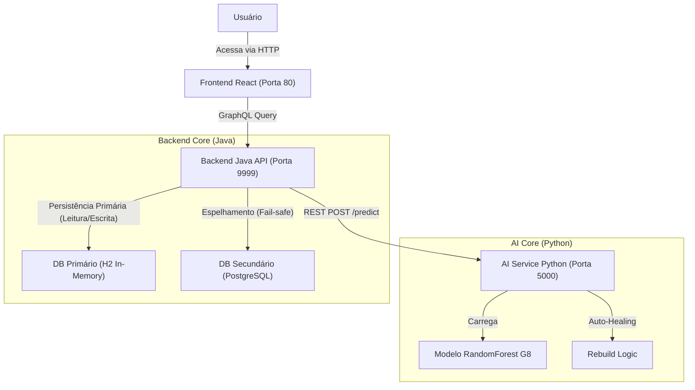

# 📊 ChurnInsight: Monitoramento de Risco de Cancelamento

> **Sistema Híbrido de Inteligência Artificial para Previsão de Churn**
> *Hackathon Alura G8 - Versão Final*


---

## 🏁 Guia Passo a Passo (Do Zero)

Este guia foi desenhado para quem acabou de clonar o repositório e quer rodar a aplicação imediatamente.

### 1️⃣ Pré-requisitos

* **Docker Desktop** instalado e **RODANDO**.
* (Opcional) Python 3.10+ instalado se quiser rodar os scripts de teste localmente.

### 2️⃣ Iniciar a Aplicação

Abra o seu terminal na pasta do projeto e execute:

```bash
docker-compose up -d --build
```

> **⏳ Aguarde:** O Backend (Java Spring Boot) pode levar de 1 a 2 minutos para iniciar completamente.

Para verificar se tudo subiu corretamente, rode:

```bash
docker ps
```

Você deve ver 3 containers rodando: `frontend-ui`, `backend-api` e `ai-service`.

### 3️⃣ Acessar o Frontend

1. Abra o navegador em: **[http://localhost:3000](http://localhost:3000)** (ou [http://localhost:80](http://localhost:80))
2. Você verá a tela de Login. Use as credenciais:
    * **Usuário:** `admin`
    * **Senha:** `123`

### 4️⃣ Testar a Aplicação

#### 🅰️ Teste Manual (Simulador)

1. No menu lateral, clique em **"Simulador Individual"**.
2. Preencha os dados do cliente (ou use os valores padrão).
3. Clique no botão **"Analisar Risco de Churn"**.
4. O sistema consultará a IA e retornará a probabilidade de cancelamento instantaneamente.

#### 🅱️ Teste Automatizado (Scripts)

O projeto inclui scripts prontos para validar a API e a Inteligência Artificial.

**No Windows (PowerShell):**
Execute o script que roda todos os testes sequencialmente:

```powershell
.\run_all_tests.ps1
```

**Ou execute individualmente (Python):**

```bash
# Teste de Fluxo Completo (Login -> Mutation -> Query)
python test_api_e2e.py

# Teste de Processamento em Lote (Batch)
python test_optimized_batch.py
```

### 5️⃣ Outros Links Úteis

| Serviço                      | URL                                                              | Descrição                                    |
| ---------------------------- | ---------------------------------------------------------------- | -------------------------------------------- |
| **API GraphQL (Playground)** | [http://localhost:9999/graphiql](http://localhost:9999/graphiql) | Para testar queries e mutations diretamente. |
| **Documentação da IA**       | [http://localhost:5000/docs](http://localhost:5000/docs)         | Swagger da API Python.                       |

---

## 🏗️ Arquitetura Técnica

O sistema opera com três microserviços integrados via Docker:



1. **Frontend (React + Vite):** Interface responsiva para upload de CSVs e visualização de dashboards.
2. **Backend (Java 17 Spring Boot):** Gerencia autenticação (JWT) e implementa padrão **Double-Write** (H2 para velocidade, PostgreSQL para robustez).
3. **AI Service (Python 3.11):** Executa o modelo de Machine Learning, com funcionalidades de **Auto-Healing** (reconstrução automática do modelo em caso de falha).

---

## 🧠 Sobre o Modelo de IA

O sistema utiliza um modelo **RandomForest** treinado para identificar probabilidade de cancelamento.

* **Classificação de Risco:**
  * 🔴 **Alto Risco:** Probabilidade > **42.87%**
  * 🟠 **Risco Médio:** Probabilidade entre **25%** e **42.87%**
  * 🟢 **Baixo Risco:** Probabilidade < **25%**

* **Entrada de Dados:** O sistema normaliza automaticamente arquivos CSV (converte `CamelCase` para `snake_case`), garantindo compatibilidade entre os dados do sistema legado e o modelo de ML.

---

## 📂 Estrutura do Projeto

* `ai_service/`: Código Python, API FastAPI e scripts de treinamento.
* `src/`: Código Java do Backend Spring Boot.
* `frontend/`: Código da aplicação React.
* `hackathon_g8_one/`: Artefatos de Data Science (Notebooks, Datasets originais).
* `docker-compose.yml`: Orquestração dos containers.

---

**Desenvolvido pela Equipe G8 - Hackathon Alura**
