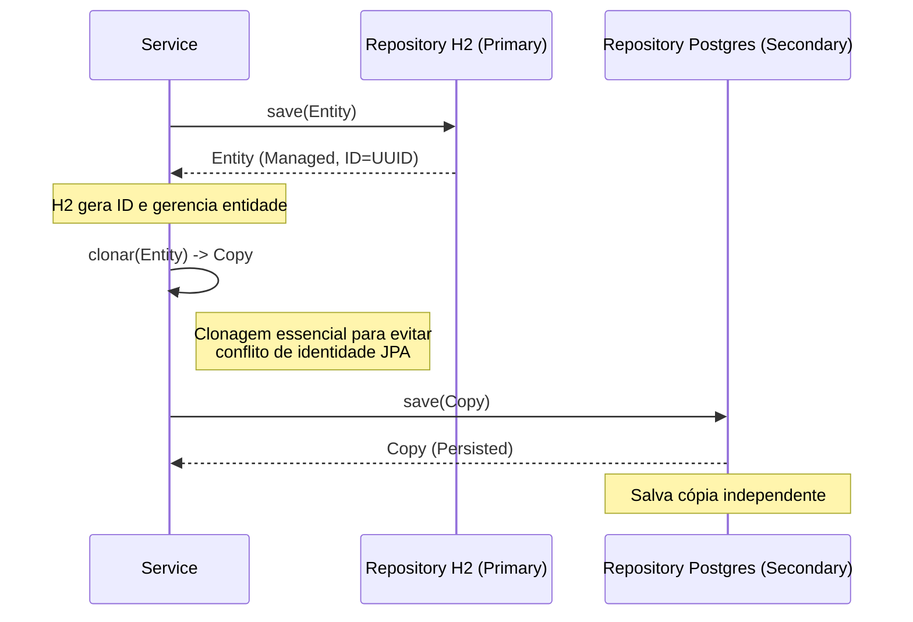

# 🏗️ Arquitetura do Sistema ChurnInsight

Este documento detalha as decisões de arquitetura técnica do projeto, com foco no padrão de persistência híbrida e tratamento de identidade de objetos.

## 🎯 Objetivo

O sistema foi projetado para ser "Cloud-Ready" mas funcional localmente com zero configuração, utilizando containers Docker.

## 🧱 Componentes Principais

### 1. Persistence Layer: Double-Write Pattern

A camada de dados utiliza uma abordagem **Híbrida de Escrita Dupla (Double-Write)** para combinar velocidade e durabilidade.

* **Primary Database (H2 In-Memory)**:
  * **Função**: Atender leituras (Queries) e escrita imediata.
  * **Vantagem**: Latência zero, ideal para testes e cache local.
  * **Configuração**: Gerenciado pelo `PrimaryDbConfig`.

* **Secondary Database (PostgreSQL)**:
  * **Função**: Backup durável (Cold Storage/Fail-safe) e auditoria.
  * **Vantagem**: Durabilidade, suporte a cargas massivas e integridade relacional.
  * **Configuração**: Gerenciado pelo `SecondaryDbConfig`.

### 🔄 Fluxo de Persistência

Sempre que um dado é salvo (via API individual ou Batch), o sistema segue este fluxo rigoroso:

### 🛠️ Desafios e Soluções (Debug History)

#### Problema de Identidade JPA

Durante o desenvolvimento, identificou-se que tentar salvar a **mesma instância de objeto** (já gerenciada pelo EntityManager do H2) no EntityManager do PostgreSQL causava uma `HibernateException`.

* **Causa**: O Hibernate monitora a identidade do objeto. Quando o segundo repositório tentava manipular o objeto (mesmo que para salvar), ele entrava em conflito com o estado gerenciado pelo primeiro repositório.
* **Sintoma**: A transação sofria rollback silencioso no H2, resultando em dados salvos no Postgres mas invisíveis na API (que lê do H2).
* **Solução ("O Debug Épico")**: Implementamos um método de **Clonagem (`BeanUtils.copyProperties`)** antes da chamada ao repositório secundário. O Postgres recebe uma instância nova, idêntica em dados, mas desconectada do contexto de persistência do H2.

## 🧩 Microserviços

1. **Backend (Spring Boot)**: Orquestrador.
2. **AI Service (Python/FastAPI)**: Worker de ML stateless.
3. **Frontend (React)**: Consumidor GraphQL/REST.

## 📈 Scalabilidade

* **Batch Processing**: Utiliza `CompletableFuture` e Thread Pool customizado (20 threads) para processar CSVs grandes, com commit em lotes (Bulk Insert) de 1000 registros para não saturar o banco.

---
*Documentação gerada por Antigravity Agent - Hackathon G8*
